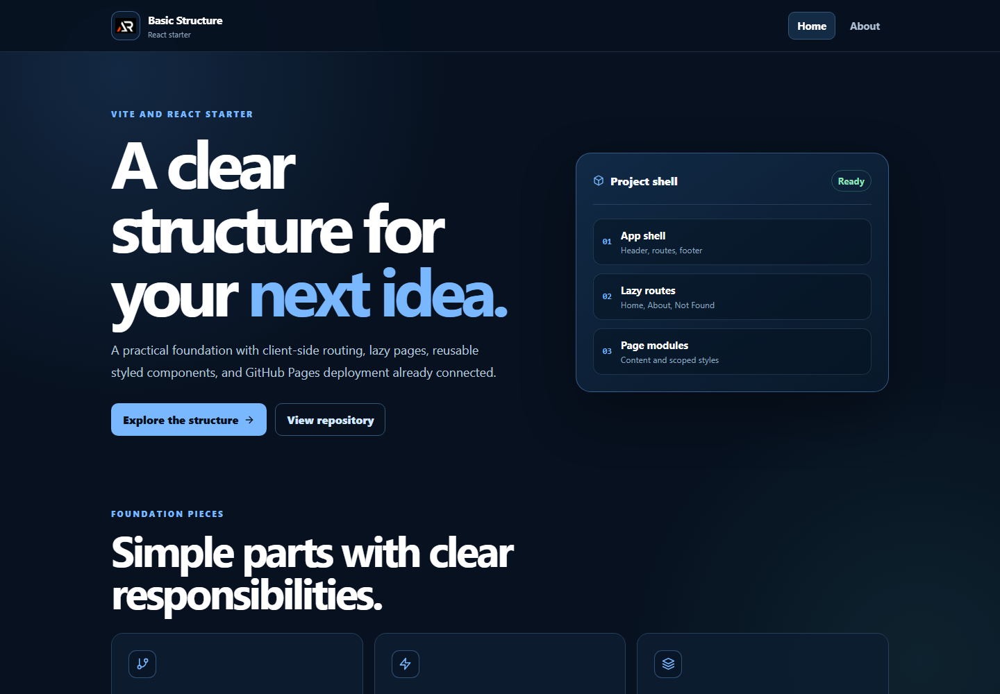

# Basic Structure



A clean Vite and React starter that demonstrates a practical application shell, client-side routing, lazy-loaded pages, styled-components, and GitHub Pages deployment.

## Features

- Home, About, and Not Found routes
- Lazy-loaded page modules with a shared Suspense fallback
- Fixed responsive header with mobile navigation
- Styled-components with clear page-level organization
- Accessible controls, focus states, and semantic content
- Icon-only social and support links
- Floating back-to-top control
- GitHub Pages base path and 404 fallback

## Tech stack

- React 18
- Vite
- React Router
- styled-components
- React Icons

## Run locally

```powershell
npm install
npm run dev
```

## Build and deploy

```powershell
npm run lint
npm run build
npm run deploy
```

Live app: [https://a2rp.github.io/basic-structure/](https://a2rp.github.io/basic-structure/)

## Future prospects

The starter can grow into a portfolio, documentation site, small dashboard, or multi-page product interface by adding route modules without changing the core application shell.

## Images

- `screenshot.png`: fresh home-screen preview used in this README
- `public/preview.png`: local social sharing image
- `public/logo.png`: brand mark used in the header

## License

This project is available under the MIT License. See [LICENSE](LICENSE).

## Links

- Portfolio: [https://www.ashishranjan.net/](https://www.ashishranjan.net/)
- GitHub: [https://github.com/a2rp](https://github.com/a2rp)
- CodePen: [https://codepen.io/ash1198](https://codepen.io/ash1198)
- LinkedIn: [https://www.linkedin.com/in/aashishranjan](https://www.linkedin.com/in/aashishranjan)
- Facebook: [https://www.facebook.com/theash.ashish/](https://www.facebook.com/theash.ashish/)
- YouTube: [https://www.youtube.com/@ashishranjan-ashz?sub_confirmation=1](https://www.youtube.com/@ashishranjan-ashz?sub_confirmation=1)
- Email: [mailto:ash.ranjan09@gmail.com](mailto:ash.ranjan09@gmail.com)

## Support

- Support: [https://a2rp-donation-page.netlify.app/](https://a2rp-donation-page.netlify.app/)
- Buy Me a Coffee: [https://buymeacoffee.com/a2rp](https://buymeacoffee.com/a2rp)
- Patreon: [https://www.patreon.com/a2rp](https://www.patreon.com/a2rp)
